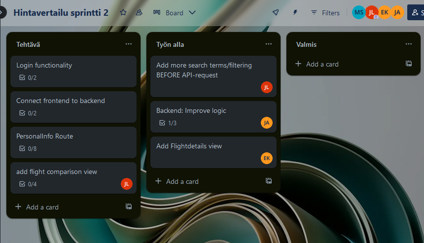

# "Flight Price Comparison" projekti - muistiinpanoja

## PROJEKTIN TAVOITE

1) Lentojen/matkustamisen/hotellien vertailuun front end (**React**)
2) Ulkoisesta rajapinnasta datan luenta (**Amadeus**)
3) Oman backendin hyödyntäminen käyttäjäietojen käsittelyyn (**Express**)
4) Tyylittelyn kehittäminen (**Tailwind**)
5) Scrum periaatteen soveltaminen työskentelyssä

## OMINAISUUDET

VAADITTUJA OMINAISUUKSIA:

- Käyttäjä voi syöttää hakutermit ja saa palautteena listan lennoista
    
    - Lentojen tiedot esitetään listana sisältäen mm. hinnan, kellonajan ja lentoajan

    - Lentoja voi filteröidä jo ennen hakua

- Käyttäjä voi uudelleen järjestellä lentoja listassa (Order by...)

- Käyttäjä voi kirjautua sisään sivulle

    - Kirjautumisen kautta käyttäjän lähtöpaikka voidaan asettaa automaattisesti, ja käyttäjä voi itse tarkastella omia toivelentojaan

- Käyttäjä voi valita lentoja vertailua varten

- Käyttäjä voi valita yksittäisen lennon ja saada lisätietoa lennon ominaisuuksista

    - EXTRA - Näytetään historiallista tietoa lennon hinnasta graafina

- Käyttäjä voi kopioida tietyn lennon tai haun URL osoitteen ja jakaa sen

    - Tämän vuoksi hyödynnetään React-routeria!

- EXTRANA:

    - Kohdemaan tietoja (julkinen liikenne, sää, nähtävyydet)

    - Haun laajentaminen - näytetään kaikki lennot tietystä maasta (Suomessa useita lentokenttiä) tai rajatulta alueelta (kartta-API)

## YLEISET ASIAT

### Työaika ja sen sisältö:

    - 25.11.2024 - 13.12.2024 arkisin

    - 6h/pv + 1h lounas

    - Sprint Planning joko maanantaisin tai perjantaisin

    - Scrum dailyt klo 09:00 - 09:15

    - Review sekä retro perjantaisin (alustavasti)

### Tekijät (päärooli + ajatukset alussa):

Erno Kauranen -- **React + API:t**

    - Saisiko mukaan data-analyysia

Jani Aalto -- **Backend + Front End tekninen tuki**

    - Projektin pääidean esittäjänä näkee mahdollisuuksia laajentaa tarpeen vaatiessa projektin skaalaa

Jenni Laakso --  **CSS ja Tailwind**

    - Tailwind osaaminen on hyödyksi työelämässä

Miikka Siitonen -- **React**

    - Datan siirtäminen komponentilta sekä Routelta toiselle tulee olemaan haaste

### Projektin etenemisen kirjaaminen:

    - Alussa Google Sheets - nyt tämä päiväkirja (28.11.)

    - Product Backlog ja User Stories - Google Sheets

    - Sprint Backlog - Trello

## PÄIVÄKIRJA

Kirjataan ylös päivän tapahtumat sekä sovitut tehtävät. Scrumissa tehtäviin tartutaan ketterästi, joten mainitut tehtävät ovat suuntaa antavia päivän fokuksista.

### 20.11.2024

Keskusteltiin mahdollisista projekteista

Jani: "Lentojen Hintavertailu" osoittautui parhaaksi

    - Löytyy API (Amadeus) - myös muita (SerpAPI)

    - Uusiokäytettäviä komponentteja

- Oma backend käyttäjätietojen käsittelyyn

- Ei Typescriptiä tällä kertaa, vaikka tietoa löytyy

- Mahdollista laajentaa:

    - Datan analyysia (kuvaajia?)

    - Karttatoiminnallisuus kohde- tai lähtömaan valinnassa

    - Kohdemaan tietojen hakeminen (julkinen liikenne, nähtävyydet, sää...)

- Keskusteltiin jokaisen toiveista - listattuna ylempänä "Tekijät" osassa

### 22.11.2024

Muodostettiin _User Stories_ - "Ominaisuudet" osio vastaa sitä pääpiirteissä

Muodostettiin ylemmän pohjalta _Product Backlog_

Sivun ulkoasun suunnittelu aloitettu Figmaa hyödyntäen

Jani aloittaa Backendiin vaadittavan teknologian selvittelyn

_Minimal viable product_ keskustelua

    - Käyttäjä löytää tarvitsemansa lennon ja tallentaa tiedot henkilökohtaiselle käyttäjätililleen

    - Front end koostuu useammasta sivusta, jotta käyttäjä voi jakaa linkin tiettyyn sisältöön

    - Lennon lisäksi varmistetaan, että projektia voisi laajentaa, jotta käyttäjä voi etsiä tietoa kohdemaassa matkustamisesta, säästä sekä nähtävyyksistä

### 25.11.2024

Sivun visuaalisen puolen suunnitelman viimeistelyä Figmassa, sekä komponenttien pilkkomista

[Avaa kuva koko näytölle tästä](./figma2.png?ref_type=heads)

Varmistettiin, että API:in liittyvät käyttörajat eivät ylity

    - Luetaan lentojen dataa itse "hostatusta" tiedostosta komponenttien asettelun ja suunnittelun aikana

Sivun skaalautuvuutta erilaisilla päätelaittella...

    - Pohditaan tarkemmin projektin lopussa

Sovittiin, että Jenni toimii Scrum-masterina aluksi

### 26.11.2024 - #1 Sprint

**Sprint Goal:**

    - API kutsut (Amadeus) toimintaan ja omaan tiedostoon

    - Pääsivun pohja (viitaten lentojen listaamiseen)

        - Button, SingleFlight, FlightList, SideBar, SearchBox, TopHeader komponentteja mm.

    - Oman Backendin tuottaminen - Express

    - Datan filtteröintiä - hintahaarukka, kellonaika, paikkojen määrä... riippuu API:n datasta

**Sprint Backlog: Trello - alla oleva kuva otettu 28.11.**

    - Jokainen itse voi pilkkoa valitsemaansa taskia Trellossa

**Definition of Done:**

    - Kun ominaisuus hyväksytään Merge Requestilla, siirtyy task "Done" osioon

    - Luonnollisesti kuitenkin, osat voivat jatkaa kehitystään myöhemmin (Product Backlog)

**Key risks and concerns** 

Ei erityistä nostettavaa - Sprint Goalin laajuutta vielä vaikea arvioida

**Notes and insights** 

Edeltävien lisäksi:

    - Backendiin dokumentaatiota, jotta senkin toiminta on ymmärrettävissä

    - Trello ja Gitlab luodaan

    - 1-2 Merge Requestia per päivä ellei palavaa syytä laajentaa

    - Kansiorakenne: /src/..., vain isommilla kokonaisuuksille /src/<kokonaisuus>/...

**Daily**

Ei otettu erityisesti ylös, mitä tarkalleen lähdetään tekemään, mutta:

Erno: API-komentojen luonti

Jani: Backendin luomisen aloittaminen, sekä Gitlab sivut

Jenni: Trellon pohja, ulkoisen API:n toiminta

Miikka: Pääsivun komponenttien luontia (Button, SearchBar, NavBar)

### 27.11.2024

**Daily:**

Tässä vaiheessa listattuna vain päivän tavoitteet:

Erno: SideBar komponentti, haun filtteröinti (ennen tai API requestin jälkeen)

Jani: Backend lähestulkoon valmis, joten sen dokumentaatio ja hienosäätö alkaa

Jenni: Edeltävän päivän API-komentojen sekä hakupalkin yhdistäminen, error sivu. Lentojen listaamiseen "Show more" nappi, sekä .env tiedostoon API avaimet

Miikka: Lentojen haun API-kutsut erilliseen tiedostoon, lentokenttäkoodin (IATA) kääntäminen maan nimeksi, kaupungiksi yms., SingleFlight ja FlightList komponentit

### 28.11.2024

**Daily:**

Erno:

    - Tänään: Eilinen SideBar jatkuu (filtterit), ja IATA koodien implementointi osaksi SingleFlight komponenttia

Jenni:

    - Tänään: Merge Request eilisistä tuotoksista, SideBar komponentin osat (filtteröinti)

Jani:

    - Tänään: Backend koodin parantelu - datan validointia. Front Endiin siirtyminen, jos taskeja on vielä auki

Miikka: 

    - Ongelmia: Eilinen IATA koodien kääntäminen, Erno viimeisteli sen!

    - Tänään: FlightList testaus, Backend tutustuminen, Päiväkirjan siirto Gitlabiin, IATA koodien implementointi osaksi SingleFlight komponenttia

MUUTA:

    - Spring Goal on aika lähellä, ja aikaa on 1.5pv... 

    - Demoon suunniteltava esiteltävät asiat (suunnitelmat, toiminta yms.)

    - API-käskyyn itsessään filtterit! Viimeinen iso Product Backlogin osa

    - .env.example Gitlabiin, jotta ulkopuolinen tietää, mitä .env tiedostossa oltava

### 29.11.2024

**Daily:**

Erno:

    - Tänään: Edeltävän päivän Merge Request check, Demo, Review tähän asti tehdystä

Jenni:

    - Ongelma: Sivupalkin filterri ei päivittänyt sivun sisältöä...
    - Ratkaisu löyty illalla
    - Mutta pari bugia vielä: Sliderit eivät pelitä ja nappien tyylittely hajonnut
    - 
    - Tänään: Filtterit ennen API-kutsua (tutkimista) ja demo

Jani:

    - Eilen: Backendin validaatio - uusi kirjasto.
    - Toimi yhteen end pointtiin
    -
    - Tänään: Sanitoidaan sisään tulevaa aineistoa
    - Koodin uudelleen järjestelyä

Miikka: 

    - Eilen: FlightList testaus, Backend tutustuttu (toimi), päiväkirja kirjoitettu
    - IATA koodien kääntö maaksi ja kaupungiksi SingleFlight komponenttiin
    - Testifunktio lentokentän/maan/kaupungin arvaamiseksi käyttäjän syötteestä
    - 
    - Tänään: Demon materiaalit

### Sprint Review

**Sprint goal review...**

Mitä lähdettiin tekemään:

    - Luodaan pääsivu (listaus)

    - Data Amadeuksesta API:n avulla

    - Backendin pohja - GET/POST/DELETE, käyttäjän tiedot ja tämän valitsemat lennot tallentuvat

    - Yksityiskohtaisempi haku - filtteröinti niin sanotusti

Mitä saavutettiin:

    - Pääsivu OK!

    - API komennot Amadeuksesta OK!

    - Backend OK!

    - Filtteröinti API-kutsun jälkeen... semi OK

Mikä on kesken?:

    - Lentojen listauksen sivupalkin modulaariset komponentit eivät olleet suunnitelmana vielä, mutta tulevat myöhemmin

    - Filtteröinti ei tapahdu ENNEN API-kutsua

Onko ongelmia, mitä ratkaista

    - Filtteröinnissä sliderit eivät aivan toimi - ei päivity vedettäessä oikein

**Demo:**

Mitä rakennettu, miten se toimii?

    - Etusivu demottu API-kutsujen kanssa, ja listaus toimi

    - Filtteröinnin nykiminen tiedostettu

**Feedback:**

Onko palautetta/kysyttävää?

    - Erno: Tehdäänkö vielä enemmän yksin, vai porukalla... Erno voisi kokeilla itsenäisempää, eli sellaisia tehtäviä!

    - Jani: Ei erityistä; Itsenäistä tähän asti, ensi viikolla Front Endiin mukaan... silloinkin sama konsepti jatkuu

    - Jenni: Ei suuria ongelmia! 

    - Miikka: DoD - huomioidaan myös koodin laatua! Ei pääse läpi enään, jos välilyönnit puuttuvat esim.

**Discussion:**

Pitääkö suunnitelmia muuttaa?

    - Amadeuksen yksittäisen lennon DATA tietyn yhtiön kautta ei riitä histogrammiin... Eli se, mitä analytiikkaa tehdään on vielä auki, mutta laitetaan tutkintaan (jatkuu)

    - Mahd. dataa JOKAISESTA lennosta menisi omaan back endiin?... Renderin instanssi ei ole PYSYVÄ! Data nollaantuu tietyn ajan välein... Vaatisi Azuren tai muun "ilmaiskokeilun"

**Next steps**

Mitä seuraavaksi?

    - Filtteröinti bugit korjaukseen! Slider, nav ja Link to... Mikä ratkaisee nykimisen ja päivityksen

        - Lisäksi ENNEN API-kutsua filtteriä

    - Uudet valinnat Backlogist (ALUSTAVA!):
        - Yksittäisen lennon esittämisen sivu
        - Kirjautumisen Modaali sekä tietojen editoinnin Modaali nappeineen
        - Henkilötietojen sivu
        - Edeltäviin yhteydet omaan Back Endiin
        - Lentojen vertailu sivu?

### Sprint Retro

Mikä meni hyvin:

    - Erno: Omalta osalta (HOKS:a mukaillen) - API jutut, monimutkainen uusi järjestelmä vrt. kurssin API:t. Saatiin aikaiseksi!

    - Jani: Backendissä itsekseen työskennellessä kaikki OK! Työmalli myös toimii!

    - Jenni: Työmalli ja ryhmätyöskentely sujuu.

    - Miikka: Sopii hyökätä puheluun kysymään apua, Scrum Master on läsnä! 

Mitkä puolet vaativat hiomista:

    - Erno: 
    
        - Milloin ryhmätyötä, milloin yksin... Muistettava siis muidenkin sanoa, haluaako yksin tehdä. 
        
        - Koodin kokonaisvaltainen ymmärtäminen vähän haastavaa myös, mutta myös kunniahimoista!

    - Jani: -

    - Jenni: Koodin luettavuutta hiottava

    - Miikka: Koodin luettavuus, "DoD". Kirjanpito on minun varassa - koska se ei liity kurssiin. Kysytty, haluaako muut tehdä, OK tämä nyt!

Mikä oli jopa haitallista:

    - Erno: Ei vielä mitään, mutta seurataan

    - Jani: Ei ole päässyt testaamaan ja näkemään Front Endiä, kun ei ole testidataa tai API-keytä. Mutta tämä onkin ensiviikon agendaa

    - Jenni: -

    - Miikka: Puhelussa ei istuta tunteja, vaan vartteja. Jotta SCRUM idea säilyy

Seuraava Scrum-Master:

- Jani Aalto

### 2.12.2024 - #2 Sprint

**Sprint Goal:**

    - Tavoitteena tuottaa loput pääsivut, Modalit sekä viimeistellä API-kutsun filtterointi

    - Yksittäisen lennon lisätietojen sivu

    - Omien henkilötietojen sivu

        - Sisäänkirjautuminen (Omaan backendiin yhteys) - 2-3 Modalia

        - Toivelistalle lisääminen (Omaan backendiin yhteys)

    - Lentojen vertailuun oma sivu

**Sprint Backlog: Trello - alla oleva kuva otettu 2.12.2024**

**Definition of Done:**

    - Kun ominaisuus hyväksytään Merge Requestilla, siirtyy task "Done" osioon

    - Luonnollisesti kuitenkin, osat voivat jatkaa kehitystään myöhemmin (Product Backlog)

    - Tässä sprintissä painotetaan myös koodin luettavuutta

**Key risks and concerns** 

- UUID:t ja lentojen tunnistus (Wishlist, compare)

**Notes and insights** 

- Figma - SingleFlight -> FlightDetails

- Johonkin listaa/dokumentaatiota, mitä dataa API:sta otetaan. Mitkä key-value pairit mm. -- FlightDetail routea tekevällä ajankohtasta

- Sprint Backlog -> Trelloon, aletaan täyttää

**Daily**

Erno: 

    - Tänään: FlightDetails route (klikataan lentoa, saadaan siitä lisätietoa) (Backlog ID 4)

Jani:

    - Tänään: Login-puoleen (Backlog ID 6)

Jenni:

    - Tänään: Haun filtteröinnin korjaus (Backlog ID 5). Slideri ei pelitä, ja ne filtterit laitettava myös ennen API-hakuun. Kun valmistuu, Backlog ID (8) lentojen vertailun Route.

Miikka:

    - Tänään: Henkilötietojen Route (Backlog ID 9)

### 3.12.2024

**Daily:**

Erno:

    - Eilen: FlightDetails route - vähän jäänyt kesken se, mitä tietoja näytetään - mutta pohja valmis!

        - Todellisen hinnan varmistus tehtäisiin POST pyynnöllä, mutta ilmeisesti näytetyt hinnat on OK(?)

        - Tarvitsisi Production ympäristön, jos tahtoisi ostaa lipun

    - Tänään: Lisää näkyviin loput tiedot FlightDetails, Formater joka käsittelee pitkiä objekti-kutsuja, dokumentaatio käytettyyn dataan

Jani:

    - Eilen: Login modaali - inputit "InputBox" komponentissa mm.

    - Tänään: Valmistuu tänään, ja sitten backendin puolelle katsomaan Loginia

Jenni:

    - Eilen: Fixattu sliderit, ja aloitettu LentojenVertailun komponentin työstö

    - Tänään: Jatkuu LentojenVertailu

    - Ongelma: Miten näytetään käyttäjälle, mitkä lennot on valittu

Miikka: 

    - Eilen: PersonalInfo kansio - Komponentit henkilötietojen esittämiseen sekä WishListin renderöintiin. Lisäksi hakupalkin piilotus, kun ei olla hakusivulla

        - Tällä hetkellä data luetaan "fetchUserData.js" scriptin avulla, testidata. Kun Login on valmis, implementoidaan oikea datan luenta

        - Oikea lentodata objekti testidataksi backendiin (Renderiin)

        - Miten pääsen käsiksi käyttäjä-objektiin - LOCAL STORAGE!

    - Tänään (ja eilen): Hakupalkille "Advanced Search"; Jatkan PersonalInfon kanssa työskentelyä, jos Log in saadaan implementoitua

    - Muuten voin toimia tukiroolissa ja etsiä tietoa/ratkaisuja... katsotaan tarkemmin päivän edetessä

    - Ongelma: Tehdäänkö tuo "Advanced Search" jotenkin omaan laatikkoon?

MUUTA:

    Ernolla ja Jennillä menoa tänään (ARVI yms.)

### 4.12.2024

**Daily:**

Erno: 

    - Eilen: FlightDetails sivun työstö

    - Tänään: Hintahistoria (Extran) työstäminen ja selvittäminen, minne se menee. Kun ne on hoidettu, selvittää seuraavan vaiheen (PersonalInfo?)

Jani:

    - Eilen: Backendiin login funktionaalisuuden.  Liitetty Front end login backendiin

    - Tänään: Jos tekee virheellisen syötteen, ei tule oikeaa virhettä... Seuraavaksi myös käyttäjätietojen päivittämisen kytkentä. Lisäksi henkilötietojen lataaminen PersonalInfo routessa

Jenni:

    - Eilen: Kahden lennon vertailussa sivusto muistaa tehdyt valinnat

    - Tänään: Ulkoasun viimeistely lentojen vertailuun - uusiokäytettää FlightDetails komponentin osia. Merge Requestit käyntiin.

        - Mahd. apuna Advanced Haussa

Miikka: 

    - Eilen: Kehittyneemmän haun luominen...

    - Ongelmia: JOS lentoja ei löydy, systeemi jäätyy pahemman kerran.

        - Esim. HEL - CAI 6.12.2024 klo 09:00, 1 aikuinen, SUORAlento ja max hinta 500e

        - Uncaught (in promise) TypeError: reduce of empty array with no initial value

    - Kun Max Pricen vaihtaa hakulaatikossa, ja koittaa hakea uudestaan, mitään ei tapahdu (useEffect!)

        - Varmistettava tässä, ettei jälkeenpäin filtteröinnissä tehdä uutta API kutsua

    - Total Time lennoissa on väärin; ei huomioi aikavyöhykkeitä

    - Ottaisin mielelläni jonkun apuun tähän tänään

    - Tänään: Kehittyneen haun viimeistely + Henkilötieto sivulle luetaan backendistä data

MUUTA:

    Miikalla ARVI klo 11:00

### 5.12.2024

**Daily:**

Erno:

    - Eilen: Hintanäkymä - graafi kuvaa hintoja "results" osiossa (FlightDetailsiin voi laittaa saapumispaikasta spesifimmin tietoa)

    - Tänään: Merge Request edeltävästä ainakin

Jani:

    - Eilen: Login toiminnallisuus. PersonalInfo liitetty Backendiin (kirjautuneen käyttäjän tiedot)

    - Tänään: Wishlist napin toiminnallisuus (front-back yhteys)

    - Ongelma havaittu: Wishlistissä ei näkynyt kaikki...

Jenni:

    - Eilen: Advanced Search työstetty kuntoon! 

    - Tänään: Merge Request "fixedAdvancedSearch"; Kun haetaan "any" luokan lentoja, tuleekin vain Economya... pitäisi palauttaa kaikki!

Miikka: 

    - Eilen: Advanced Search Jennin kanssa saatettu toimintaan; otin myös selvää, miksi Wishlist-listassa ei näkynyt kaikki lennot (syynä useEffect "Wishlist.jsx" tiedostossa) -> "PersonalInfoBranch" sisältää ratkaisun, pitää vaan Mergata

    - Tänään: Demo (raamit luotu aamulla); Mergaa "PersonalInfoBranch"; Flight Class vaihtoehto "any" tuottaa vain "Economy" lentoja (korjaan)

    - Havaittuja ongelmia: PersonalInfo sivulla "Compare flights" napit eivät toimi; Wishlist napit eivät toimi; "Wishlist syynä Propsien puute" - Jenni

### Sprint Review

Demosta saatiin palautetta, ja ne löytyvät tästä osasta

**Sprint goal review...**

Mitä lähdettiin tekemään:

    - Rakennetaan vertailusivu, henkilötietosivu, yksittäisen lennon sivu, yhdistetään front-back end sekä "kehittynyt haku"

Mitä saavutettiin:

    - Kaikkien pääpiirteet toimivat

Mikä on kesken?:

    - Compare buttonit eivät toimi Wishlistissä, graafi hinnoille näkyy listassa muttei muuta, käyttäjätietojen muokkaaminen puuttuu

Onko ongelmia, mitä ratkaista:

    - Advanced Search tuotti harmaita hiuksia... ratkesi tehdessä yhdessä, ja käytiin alusta alkaen logiikka läpi

        - Rautalangasta väännettiin parametrit erilleen URL-syötteeseen, jolloin virheitä ei tapahdu

**Demo:**

Mitä rakennettu, miten se toimii?

    - Esitetty

Vertaisryhmien ehdotuksia:

    - Edellisen haun tallennus ulkoisesti - TanStack Query

        - Erno: Tanstack kiinnostaa kyllä - jos ei aukea, niin Stateen

        - Jani: State on ihan OK! Mutta jos tekijä löytyy, niin Tanstack saa kokeilla

        - Jenni: Voi kokeilla Tanstackia

        - Miikka: Perus state riittää

    - FlightComparison - Vertailuun värikoodaus (visuaalinen puoli)

        - Jenni: Pitäisi olla mahdollista implementoida - Tailwind ehdollistetaan

        - Erno: En kuvittele olevan vaikeaa

    - Wishlist-nappi -  Lisättäessä ilmaisu, että toiminto onnistui

        - Jani: Toast ilmoitus tai vastaava ilmoitus. Disablointi mahdollista tai Poisto

        - Jenni: Toimiiko vielä Backendissä poisto? (Toimii)

    - TailWind - Painikkeiden tekstit eivät erotu (väri, fontti?)

        - Ilmeisesti värit olivat ongelmana

    - Tieto tulee listaan; Saisiko automatisoitua scrollauksen, ettei tarvitsisi napista ladata lisää lentoja

        - Miikka: Ylimääräistä höttöä

        - Erno: Onko tärkeysjärjestyksessä MISSÄ...

        - Jenni: Ei erityisen tärkein

        - Jani: "Load more" funktionaalisuus asetetaan ruudun pohjaan, tai sen lähelle, ja kutsutaan sitä. React event huomaa!

**Feedback:**

Onko palautta/kysyttävää?

    - Erno: Kaikki ovat tuoneet ajatuksensa esiin hyvin

    - Miikka: Sprint Backlog pilkottava paremmin - ei 13 checkboxin taskeja, vaan mieluummin tuollainen olisi erillisinä taskeina

**Discussion:**

Pitääkö suunnitelmia muuttaa?

    - ... hyvin aikaa, ja arvioida Product Backlogia

**Next steps**

Mitä seuraavaksi?

    - Backlogin tarkastelu maanantaina

### Sprint Retro

Mikä meni hyvin:

    - Erno: "Kaikki" - ongelmat ratkottiin tehokkaasti yhdessä. "Hyödyn mittari ei ole, että kaikki menee suoriltaan"

    - Jani: Viime viikon tahti säilyi. Nostona, että Front Endiinkin pääsi kiinni

    - Jenni: Koko viikko on hyvin edennyt, ryhmätyöskentelykin

    - Miikka: Projekti etenee odotetusti

Mitkä puolet vaativat hiomista:

    - Erno: -; viime viikon asiat parantuneet

    - Jani: -

    - Jenni: Ei kummempaa

    - Miikka: -

Mikä oli jopa haitallista:

    - Erno: -

    - Jani: -

    - Jenni: -

    - Miikka: Toimin "ankkuri-merenpohjassa". Advanced Search ei toiminut, joten piti ottaa toinen henkilö apuun - vein resursseja. Ei olisi toisaalta valmistunut, jos Jenni ei olisi tullut hätiin. "Get good", tai suunnittele paremmin tulevaisuudessa

Seuraava Scrum-Master: Erno

### 9.12.2024 - #3 Sprint

- Product Backlog katsottu, ja viime viikkoisen demon jäljiltä uudelleen järjestelyä sekä pari lisäystä

**Sprint Goal:**

    - Viime viikon demotuksessa tuodut ehdotukset otetaan osaksi sprinttiä

    - Viimeistellään wishlist nappi ja henkilötieto-asiat

    - Tyylittelyn viimeistely - Figma toimii pohjaan

    - Syötteen prediktaus ja lentojen listauksen järjestelyyn "order by" asetus

    - Pientä hienosäätöä kaikin puolin

**Sprint Backlog: Trello - alla oleva kuva otettu 9.12.2024**

**Definition of Done:**

    - Ei muutosta - Toinen henkilö tarkastaa Merge Requestin (ja koodin laadun)

**Key risks and concerns** 

    - Miikka perjantaina 13.12. läsnä, muttei välttämättä pääse puheluihin. Ongelmia ei synny, jos kommunikoi tekstillä tarpeen vaatiessa

**Notes and insights** 

    - Tuotteen skaala otettu puheeksi ja Sprintin sisältö käyty läpi

**Verbal confimation**

    - OK! Trelloa tehdessä aukenee paremmin

**Follow up**

    - Lähdetään tuottamaan Trello ja aloitetaan jo tiedossa olevat tehtävät

**Daily**

Erno: 

    - Tänään: Tallennetaan edeltävä haku stateen tai vastaavaan; Jos hinta-graafia ei ole, annetaan virhe viesti

Jani:

    - Tänään: Jatkaa Wishlist-napin toimintaa (disablointi mm.) Backend-frontend koodin siistintä

    - klo 15 poissa

Jenni:

    - Tänään: Compare napin toiminta Wishlistissä, "Compare view" värien ehdollistus.

    - "HowManyShown" parametrin nosto URL:iin tai Scrollauksen implementointi... jos aikaa

Miikka:

    - Tänään: Lentojen listauksen järjestelyyn asetus (Order by)

### 10.12.2024

**Daily:**

Ongelmia: -

Erno:

    - Ongelmia: LocalStorage clearaaminen OIKEIN; SessionStorage voisi toimia!

    - Eilen: 

    - Tänään: PriceGraph ei löydy, niin tultava jokin virheviesti. SessionStoragen laittaminen aiempaan hakuun sekä API-tokenin tallentaminen (ei aina uutta)

Jani:

    - Eilen: Wishlist nappulan toiminta - muuttuu klikattaessa (ja poistaminen toimii Wishlistin kautta)

    - Tänään: Personal Info Modal - henkilötietojen vastaanotto ja lähetys Back endiin

Jenni:

    - Eilen: Compare sivun väritys tehty, compare napin toiminta wishlistissä toimii nyt. Uudet tiedot ladataan näkyville scrollaamalla aloitettu...

    - Tänään: src kansion uudelleen organisointi (tehty aamulla jo). Scrollauksen säätö jatkuu, Tailwind myös yleisesti

Miikka: 

    - Ongelma: Hae "HEL - CAI"... Results sivulla tee uusi haku "HEL - OSL"... mene yksittäisen lennon yksityiskohtiin... ja palaa Back napilla... Hakupalkissa TAAS HEL - CAI!!!

    - Eilen: "Order by"/Sorttaaminen tuotettu. Aloin tutkimaan, miten AutoComplete saadaan toimimaan

        - Kysytty eilen päivän päätteeksi, onko OK käyttää netistä löydettyä ratkaisua yleisesti

        - Mielipiteet: OK! x4

    - Tänään: 
    
        - "Rangaistuksena" kommentoin löydetyn AutoComplete ratkaisun, jotta YMMÄRRÄMME sen toiminnan

        - Implementoin AutoComplete koodin meidän syöttökenttiin (To... From...) - yhdistetään Airports.json/js koodiin

        - IATA koodit ovat vain hyväksyttyjä API-kutsuissa - joten ohjataan käyttäjä valitsemaan se! "Finland" -> Ehdotetaan HEL, JYV... 

### 11.12.2024

**Daily:**

Erno:

    - Eilen: Weather API tutkimus, SessionStorage ja API-tokenin säilytys. Lisäksi jos graafia ei ole tarjolla, tulee "virheviesti"

    - Tänään: Weather API jatkuu ja Miikan kanssa työskentelyä

Jani:

    - Eilen: Henkilötietojen modaali Frontissa, ja yhteys Back endiin. 

    - Tänään: ^ Parantelun varaa. Tarkoituksena myös muuttaa, miten oma lokaatio tallennetaan ja palautetaan Front Endiin

Jenni:

    - Eilen: Tailwind ja Scrollaus

    - Tänään: Korjattu jo aamusta eilisen bugin liittyen lentojen näyttämiseen - rullatessa sivua (mergataan). Tailwindin kanssa jatkuu tämä päivä

Miikka: 

    - Ongelma: Bugeja eilisessä tuotteessa

    - Eilen: Käyttäjän syötteen "arvaaminen" toteutettu.

    - Tänään: Korjaan eilisiä bugeja ja hakupalkin kellonajan hyödyntäminen filtteröinnissä

### 12.12.2024

**Daily:**

Erno:

    - Eilen: Sää-API sekä Flightdetails sisältöjä

    - Tänään: Tiettyyn matkaan liittyy useimmiten viivästyksiä, näytetään siitä tietoa detailsissa

Jani:

    - Eilen: Käyttäjätietojen uudelleen syöttö ja tallentaminen back endiin

        - Käyttäjän lentokentän "automaattinen" syöttö To... ruutuun

    - Tänään: Korjattava bugi edeltävään liittyen (kirjautuessa sisään
    searchbar ei ole tietoinen tarkalleen käyttäjän lentokentästä)

        - Modaalin parantelua ja wishlist extrat Trellosta (pari kohtaa)

Jenni:

    - Eilen: Tietojen näyttämisen scrollaus toiminnassa + Tailwind edennyt

    - Tänään: Tailwind jatkuu (searchBar) - bugien ratkonta (haun jälkeen Back nappia painamalla ei säily hakupalkissa kaikki tiedot)

Miikka: 

    - Ongelma: -

    - Eilen: From... to... syötteiden bugit korjattu. Time huomioidaan hakua tehdessä. Home nappi.

    - Tänään: "airports.json" yms. tiedostot, sekä "http" pohjaiset tiedoston avaamiset... saisiko pois?. Demoon kuvat ja päiväkirjan tiivistys

### 13.12.2024

**Daily:**

Erno:

    - Eilen: Flight Details ja Delayn merkintä sinne. Tyylittelyä ja bugien keskustelua

    - Tänään: Demoa? Trellon vilkaisu

Jani:

    - Eilen: Käyttäjätietojen päivittämisen pohja tehdyt
        
        - Myös käyttäjän nimi päivittyy nappiin

    - Lisätty Back Endiin, ettei voi tallentaa samaa lentoa kahdesti

    - Tänään: Front Endiin ilmoitukset, jos yrittää lisätä uudestaan + Back End siistintä

Jenni:

    - Eilen: Hakupalkin bugin selvittelyä (tiedot eivät säily From... To... palkeissa)

    - Tänään: Aamusta saatu bugi vihdoin korjattua(?) 

Miikka: 

    - Eilen: Hakupalkin "vaaditut kentät", Submit disabloidaan. "Localhost" viittaukset poistettu

    - Tänään: Demoon keskittyminen (menoa tänään, poissa 1-2h)

Aikataulutus:

- Retro/Review - Toivon mukaan lounaan jälkeen

- Demon valmistelu - Ennen ja lounaan jälkeen

    - Demon jakaminen (myöhemmin(?))

Demon jako:

    - Projektin perusidea + Käytetyt teknologiat -- Jani

    - Vastuualueet + Dokumentaatio (README.MD:t) -- Jenni

    - Toiminnallisuudet (eli Demo) -- Miikka

    - Haasteet + Onnistumiset + Tärkeimmät opit -- Erno

### Sprint Review

**Sprint goal review...**

Mitä lähdettiin tekemään:

    - Viime viikon demon ehdotukset (automaattinen listan pidennys scrollaamalla, ja ulkoasu)

    - Aiemman haun muistaminen (SessionStorage)

    - Wish-list logiikka sekä henkilötietojen logiikka (Back end yhteys)

    - Syötteen ehdotukset sekä tulosten järjestely (Order by)

    - Tyylittelyn viimeistely - Figma toimii pohjana

    - EXTRAA! Sää, lentojen myöhästymisen todennäköisyys... Jos keretään aloittaa

Mitä saavutettiin:

    - Kaikki edeltävä pääpiirteissä

        - Pieniä bugeja jäi elämään

Mitä jäi tekemättä?:

    - Share nappi - koska yksittäistä lentoa on vaikea muistaa (uniikit ID:t puuttuvat Amadeuksen datassa) ja oma järjestelmä vaatisi Back Endin laajentamista... tarkoituksena Front End joten jätetty pois

    - Virheen käsittely paikoittain kunnossa, mutta "error 404" tyyliset menee ilman tarkempia kuvauksia "Oops! sivulle"

Onko ongelmia, mitä ratkaista:

    - Useampi tiedosto, mistä luetaan dataa Front Endin Public kansiossa... saisiko tiivistettyä?

    - Routetus on vähän purkkapalloa

**Demo:**

Mitä rakennettu, miten se toimii?

    - Diat luotu (katso Loppudemo.pdf)

**Feedback:**

Onko palautetta/kysyttävää?

    - No comment

**Discussion:**

Pitääkö suunnitelmia muuttaa?

    - Ei

**Next steps**

Mitä seuraavaksi?

    - Demon diojen hienosäätö ennen demoamista; Demon lentoreitit tsekattava

    - Jos projektia "jatkaisi", niin seuraavaksi:

        - Kohdemaasta lisää tietoa (hotellit yms.); Kartta-API avustamaan hakua; Back Endiin OIKEA tietokanta; Json/js tiedostojen yhdistys

### Sprint Retro

Mikä meni hyvin:

    - Erno: Tiimityöskentely!

    - Jani: Yleisesti kaikki sujui hyvin

    - Jenni: Tiimityöskentely/ryhmätyö (ja Scrum yleisesti) sujunut hyvin

    - Miikka: Trello! Intoa oli tehdä hommia sen laadun vuoksi

Mitkä puolet vaativat hiomista:

    - Erno: -

    - Jani: Hiukan enemmän olisi voinut osallistua Front Endin ongelmanratkontaan

    - Jenni: Vaihdettiin "useLoader" tilalle "useLocation"... ei oikein ollut selvää, miksi tämä korjasi hakupalkin ongelmat

    - Miikka: Motivaatio katosi torstaina - ehkä koska projekti lähestyi loppuaan (mitä voisi vielä tehdä, joka on hyödyllistä)

Mikä oli jopa haitallista:

    - Erno: -

    - Jani: -

    - Jenni: -

    - Miikka: -